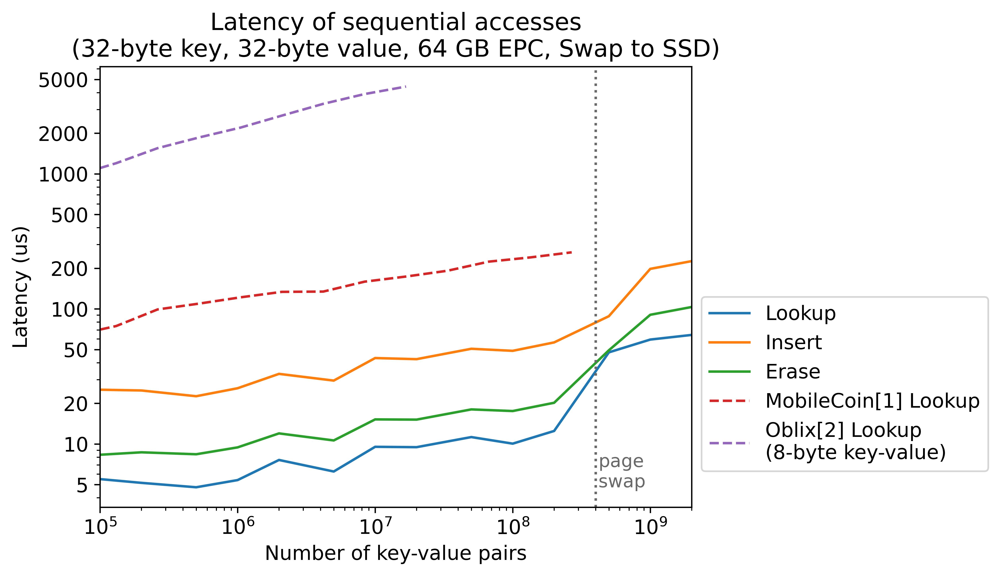
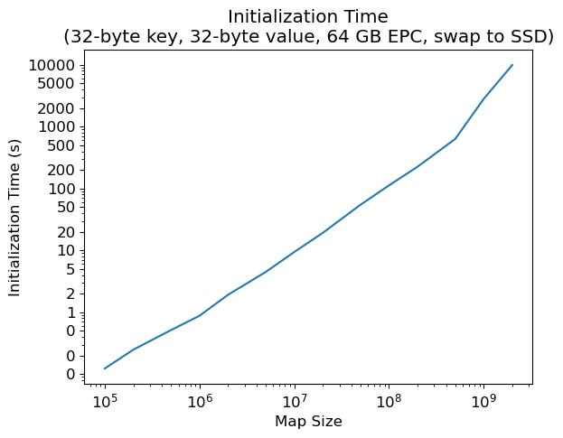
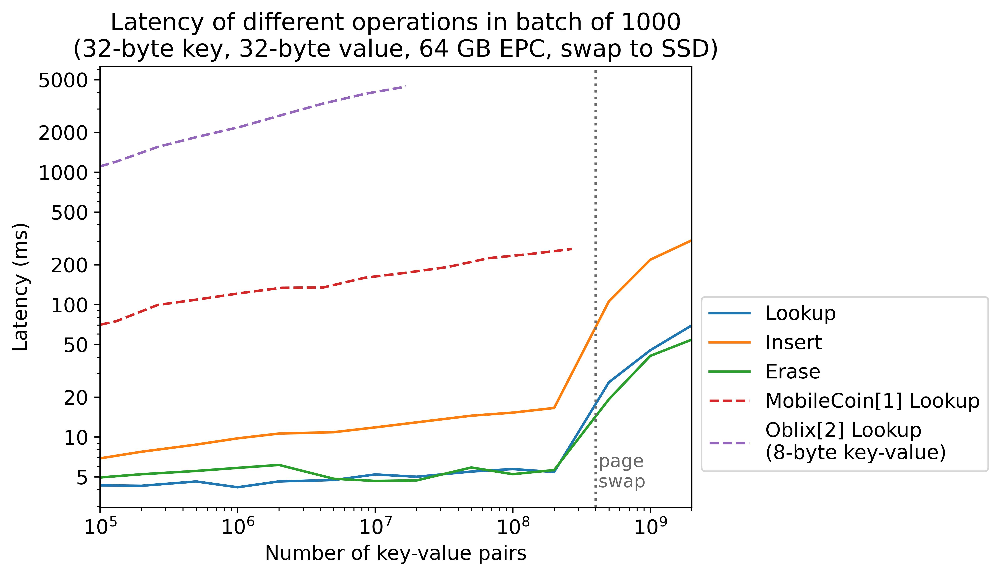
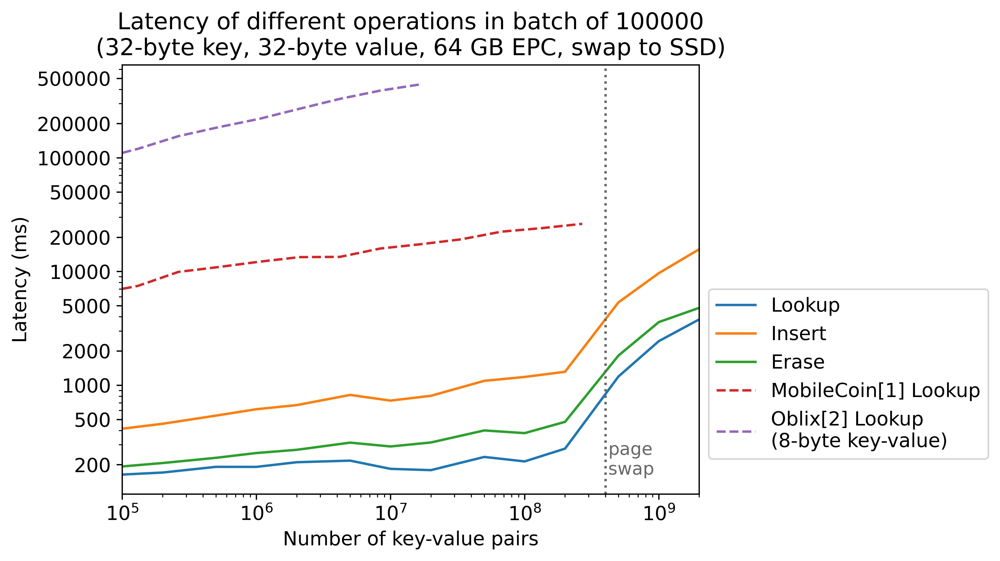
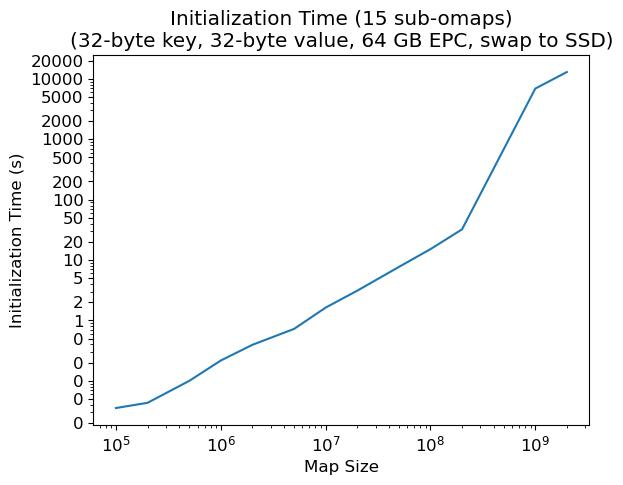

# Oblivious Map
This repository hosts an implementation of parallel oblivious maps designed for external memory efficiency. The map support oblivious insertion, erasure, and lookup operations for key-value pairs. The term "oblivious" denotes that both the memory access pattern and disk swaps appear independent of the secret data, thus ensuring privacy beyond mere encryption. Additionally, the repository includes example applications of oblivious maps in SGX and provides bindings for Rust and Golang.

## Prerequisites
Install cmake, ninja and intel sgx sdk, or use the cppbuilder docker image.

## How to build the builder docker image
```bash
docker build -t cppbuilder:latest ./tools/docker/cppbuilder
```

## How to enter the docker environment to run unit tests
```bash
docker run -it --rm -v $PWD:/builder -u $(id -u) cppbuilder
```

## How to enter the docker environment to run algorithms in enclave
```bash
docker run -v /tmp/omapbackend:/ssdmount --privileged -it --rm -v $PWD:/builder -p 8080:8080 cppbuilder
```

## How to run the unit tests
```bash
rm -rf build
cmake -B build -G Ninja
ninja -C build
ninja -C build test
```

## How to run the unit tests in release mode

```bash
rm -rf build # Needed after the CC/CXX export or after changing the CMAKE_BUILD_TYPE
export CC=/usr/bin/gcc
export CXX=/usr/bin/g++
cmake -B build -G Ninja -DCMAKE_BUILD_TYPE=Release
ninja -C build
```

## Build the omap example enclave (hardware mode)
```bash
source /startsgxenv.sh
cd applications/omap
make
```

## Build the omap example enclave (simulation mode)
```bash
source /startsgxenv.sh
cd applications/omap
make SGX_MODE=SIM
```

## Run a sample script to test runtime of omap algorithms
```bash
cd applications/omap
./algo_runner.sh
```

## Folder structure high level details

`omap` - C++ oblivious map library code

`tests` - C++ tests modules

`applications` - Enclaves example of omap

`tools` - tools used to generate graphs or test sets

`tools/docker` - dockerfiles used for reproducible builds


### omap folder structure

`odsl` - core library code of oblivious data structures

`algorithm` - algorithmic building blocks for oblivious data structures

`common` - common c++ utilies, cpu abstractions, cryptography abstractions and tracing code

`external_memory` - external memory vector abstraction

`external_memory/server` - server abstraction for different external memory scenarios (sgx, file system, ram)

`interface` - foreign language interface

## Performance Benchmark

The benchmark below is conducted in SGX prerelease mode with an Intel(R) Xeon(R) Platinum 8352S processor (48M Cache, 2.20 GHz). We limit the enclave size to be 64 GB, and swap the rest of the data to an SSD.

### Sequential Access

First, we test the average latency of sequential access. In the test, each access is launched right after the previous access returns the result. A pipelining optimization is enabled to utilize multiple cores.






### Batch Access

Then, we test the average latency for a batch of accesses. The accesses are obliviously load-balanced to multiple sub omaps and processed in parallel. When data fits in the enclave, batched access is faster than sequential access due to more parallelism; otherwise, the performance are close since both are limited by the I/O bandwidth.







## Architecture Overview

Below, we give an overview of our oblivious data structure in a top-down order.

### Parallel Oblivious Map for batch queries

When queries arrive in batches, we implement an oblivious load balancing mechanism to distribute them across multiple shards of the oblivious map, enabling parallel query processing. Drawing inspiration from Snoopy (referenced at https://eprint.iacr.org/2021/1280), we have refined and optimized their load balancing algorithm. The corresponding implementation is available at `odsl/par_omap.hpp`.

### Oblivious Map

Our oblivious map employs blocked cuckoo hashing with a stash to map long keys from a sparse space to memory addresses in a denser space. Using two hash tables, T1 and T2, an element x can be located in either location h1(x) of T1 or h2(x) of T2, utilizing hash functions h1 and h2 respectively. Each location can store multiple elements, increasing associativity and the load factor of the cuckoo hash tables. When both locations are full, the element may be stored in a stash. Cuckoo hashing offers O(1) worst-time complexity for look-up and deletion, making it ideal for oblivious data structures that conceal access counts during probing.

Insertion involves repeatedly evicting existing elements from the table when collisions occur. A naive approach to support oblivious insertion pads the number of evictions to a maximum threshold. Our map reduces the number of accesses by deamortizing evictions using the stash.

For keys and values under 32 bytes, it is efficient them directly in the cuckoo hash table (`odsl/omap_short_kv.hpp`). Longer keys and values are processed by cuckoo hashing to a position map and stored in a separate non-recursive ORAM (`odsl/omap.hpp`). This optimization reduces storage and computational overhead.

### Recurisve ORAM

The hash table in the oblivious map is implemented with a recursive ORAM (`odsl/recursive_oram.hpp`), offering an interface akin to an array, enabling random access at any location. The construction of this recursive ORAM draws from various ORAM literatures, including binary-tree ORAM, Path ORAM, and Circuit ORAM. It comprises a non-recursive ORAM storing the data and a position map to track data locations.

Specifically, after each access, the accessed data entry is assigned to a random new position in the non-recursive ORAM, with the position map updated accordingly. To conceal access patterns, the position map is implemented with a smaller recursive ORAM. At the base recursion level, the position map resorts to a naive linear ORAM, where each access is conducted via linear scan.

### Non-Recurisve ORAM

We adopt Circuit ORAM (https://eprint.iacr.org/2014/672) to instantiate the non-recursive ORAM, which offers the best concrete efficiency in our tests (`odsl/circuit_oram.hpp`). The ORAM consists of a binary tree of buckets. Each entry in the ORAM is assigned a random leaf node, and may reside in any bucket on the path from the root to its assigned leaf. The assigned leaf ID is tracked with a recursive position map, as mentioned in the previous section. During an access, the entry is obliviously extracted from the path and assigned a new leaf node to write back to. Note that we cannot directly move the element to the assigned leaf (or anywhere on the path except the root); otherwise, the access pattern will be leaked when the entry is accessed again. Instead, all entries are initially placed in the root bucket and then continuously evicted towards their assigned leaves following a deterministic access pattern. Circuit ORAM introduces an efficient oblivious eviction algorithm that operates in O(log N) time per access, where N is the size of the ORAM.

### External-memory Efficient Binary Tree

The binary tree structure in Circuit ORAM is implemented in `odsl/heap_tree.hpp`. Since the size of the data may exceed the available secure memory, we adopted an external-memory efficient layout as described in EnigMap (https://eprint.iacr.org/2022/1083). The top k levels of the tree reside in secure memory, while the remaining nodes are packed into pages in external memory. Crucially, each page contains small subtrees, enhancing locality when accessing nodes on a path.

As an additional optimization over EnigMap, we utilize the deterministic eviction pattern of Circuit ORAM to further enhance locality by packing nodes on successive eviction paths. Because the tree structure is fixed, we rely on an indexer to reference the nodes, eliminating the overhead of pointers.

### Direct-map Cache and LRU Cache

To utilize the locality of our binary tree structure, the pages in external memory are managed with a cache. We implemented both a direct-mapped cache (`common/dmcache.hpp`) and an LRU cache (`common/lrucache.hpp`). By default, the direct-mapped cache is used due to its significantly smaller overhead.

### Storage Frontend for Encryption/Decryption

Assuming that the data is stored partly in secure memory and partly in insecure external memory, we need to encrypt the data when swapping it to external memory and decrypt it when swapping it back. The storage frontend (`external_memory/serverFrontend.hpp`) handles this encryption and decryption procedure. We use the AES-GCM scheme to provide both secrecy and authenticity. To fully utilize hardware acceleration, we recommend a page size of at least 1 kB. When accessing 4 kB pages, our custom page swap handler is about 16 times faster than using the default dynamic page swap feature in Intel SGX v2.

To conserve secure memory space, we do not check the freshness of the pages at the storage frontend. Instead, we use a version number tree to resolve freshness. Each node in the binary tree stores the number of times its children have been accessed, which is sufficient for finding mismatches and preventing replay attacks.

### Storage Backend

The storage backend (`external_memory/serverBackend.hpp`) allocates memory for the frontends and proxies the page swaps to the untrusted servers.

### Untrusted Servers

The untrusted servers (`external_memory/server/***_untrusted.hpp`) manage data in the external memory. For applications running in an Intel SGX enclave, an Outside Call (OCall) must be made from the storage backend to trigger the methods in the untrusted server.

### Other Utilities

#### Oblivious Sorting, Compaction, and Merge-split

The load balancer of parallel ORAM utilizes various oblivious algorithms such as sorting, compaction, and merge-split. These algorithms are implemented in `algorithm/` folder.

#### Oblivious Move and Swap
`common/mov_intrinsics.hpp` implements oblivious conditional moves and swaps with SIMD acceleration.

#### Cryptographic Functions
The encryption/decryption and secure hash functions are defined in `common/encutils.hpp` and `common/encutils.cpp`.

## Foreign Language Interface
We provide some wrapper classes to bind foreign languages in `interface`. In the `application` folder, we provide examples of Golang and Rust binding.